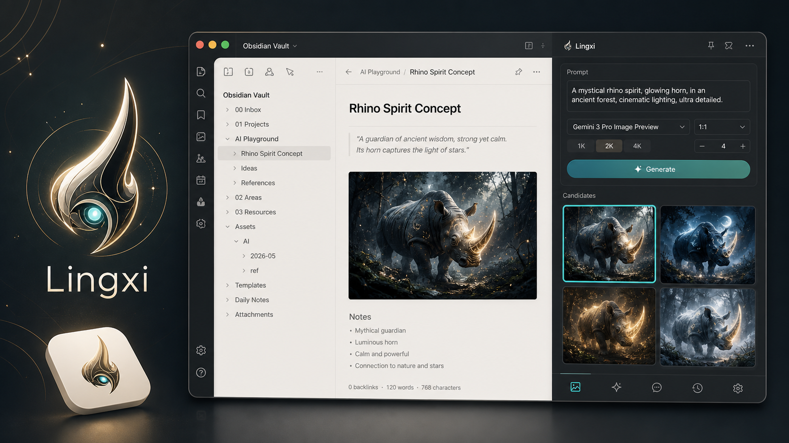

# Lingxi

> Obsidian sidebar image studio: generate, compare, regenerate, and insert AI images directly into notes.



Lingxi is an Obsidian plugin focused on one practical workflow: turn note context and prompts into image candidates, then insert the chosen result back into the active Markdown note. It is designed for writers, knowledge workers, designers, and presentation creators who want image generation to stay inside their vault instead of switching between external tools.

[简体中文](#简体中文) | [English](#english)

---

## 简体中文

### 项目分析

Lingxi 当前已经不是一个简单的 API 调用面板，而是一个围绕 Obsidian 笔记场景设计的侧边栏生图工作台。

| 维度 | 结论 |
| --- | --- |
| 产品定位 | 面向 Obsidian 的「笔记上下文 + 候选图」生图插件 |
| 核心用户路径 | 打开笔记 -> 输入提示词或引用当前笔记 -> 批量生成候选图 -> 挑选/重生/插入 |
| 技术结构 | Obsidian `ItemView` + Provider 适配层 + 候选图队列 + 设置页模型目录 |
| 当前优势 | 候选图管理、图生图参考图、PPT 拆页、Codex CLI、本地图片校验 |
| 主要边界 | Codex CLI 依赖本机环境；真正的生图速度仍取决于所选模型和网络 |

源码已经按职责拆分：

- `src/api/*` 负责 Provider 路由和生图接口适配
- `src/notes/*` 负责侧边栏 UI、任务队列、候选图、参考图和笔记插入
- `src/settings/*` 负责设置页、模型目录和 Provider 配置
- `src/utils/*` 负责图片保存、图片提取和文件头校验
- `tests/*` 覆盖模型目录、错误归一、提示词工具、参考图解析和图片签名校验

### 核心能力

- 侧边栏候选图工作流
  - 生成 1 到 9 张候选图
  - 候选图支持插入、重生、丢弃、复制提示词、复制 Obsidian 嵌入语法
  - 支持一键插入全部已完成候选图
  - 大量候选图使用虚拟渲染，减少滚动卡顿

- 笔记上下文生图
  - 支持 `@current_note`、`{{current_note}}`、`@当前笔记`
  - 单独输入 `@` 会自动补成当前笔记占位符
  - 可从当前选区或当前笔记内容注入上下文
  - 可读取笔记内已有图片作为参考图输入

- 图生图
  - 支持上传本地参考图
  - 支持从当前笔记选择已有图片
  - 支持拖拽替换参考图
  - 自动把主参考图名称同步到提示词首行，强化引用关系

- PPT 与多页视觉生成
  - 支持 PPT 自动拆页提示词
  - 可按页数拆成多个生成任务
  - “张数”参数在 PPT 模式下表示每页候选数

- 稳定性
  - 根据网络状态自动调整并发
  - 对超时、网络异常、服务异常做可重试归一
  - 支持取消正在运行的生成任务
  - 拒绝伪图片或随机字节，要求 PNG/JPEG/WebP/GIF 有效文件头
  - 候选图 24 小时 TTL 清理

### 截图


### Provider 支持

| Provider | 用途 | 说明 |
| --- | --- | --- |
| OpenRouter | 文本模型和图片模型 | 可在线拉取模型列表，并过滤图片模型 |
| OpenAI | 文本模型和图片模型 | 内置 `gpt-4o-mini`、`gpt-5` 系列、`gpt-image-2` 等目录 |
| Gemini | 文本模型和图片模型 | 内置 Gemini 文本模型和 Nano Banana / Gemini image 模型 |
| Codex CLI | 桌面端本机命令桥接 | 通过 `codex exec` 执行提示词，可让 Codex 在 vault 图片目录创建文件 |

Codex CLI 默认参数：

```bash
exec --skip-git-repo-check --sandbox workspace-write --ephemeral --ignore-rules
```

插件会在运行时把 Codex 工作目录指向 vault 图片目录。如果设置里的 Codex 工作目录留空，默认使用：

```text
Assets/AI
```

Codex CLI 返回值必须包含以下任一结果：

- `data:image/...;base64,...`
- 本地图片绝对路径
- `file://` 图片 URL
- Markdown 图片链接

### 安装

#### Release 安装

1. 下载 Release 包。
2. 解压到你的 vault：

```text
.obsidian/plugins/lingxi/
```

3. 重启 Obsidian。
4. 在 `设置 -> 第三方插件` 中启用 `Lingxi`。

#### 本地开发安装

```bash
npm install
npm run build
bash scripts/deploy-dev.sh /path/to/your/vault
```

### 快速开始

1. 打开一篇 Markdown 笔记。
2. 点击左侧 Lingxi 图标打开侧边栏。
3. 选择 Provider，并配置 API Key 或 Codex CLI。
4. 输入提示词，或使用 `@current_note` 引用当前笔记。
5. 设置模型、比例、分辨率和张数。
6. 点击 `生成`。
7. 在候选图卡片中选择 `插入`、`重生`、`复制提示词` 或 `复制嵌入语法`。

### 推荐工作流

#### 从笔记生成配图

```text
@current_note
生成一张适合这篇笔记的封面图，要求风格统一、构图清晰、不要文字。
```

#### 用已有图片做参考

1. 打开 `图生图`。
2. 上传图片，或从当前笔记选择图片。
3. 点击 `优化` 生成保真优先提示词。
4. 生成候选图并挑选结果。

#### 生成 PPT 分页视觉

```text
基于 @current_note 做 6 页 PPT，每页生成一张可直接作为幻灯片背景的画面。
```

点击 `优化` 后，Lingxi 会生成 PPT 自动拆页提示词，生成时按页拆成任务。

### 设置说明

| 设置项 | 说明 |
| --- | --- |
| API Provider | 选择 OpenRouter、OpenAI、Gemini 或 Codex CLI |
| Image generation model | 当前 Provider 的图片模型 |
| Quick switch image models | 把常用图片模型加入快捷切换 |
| Image save location | vault 内图片保存目录，留空时保存到当前笔记同目录 |
| Image compression quality | 读取参考图时压缩为 WebP 的质量 |
| Image max size | 参考图最大边长 |
| Image system prompt | 生图系统提示词 |
| Image Generation Timeout | 生图请求超时时间 |
| Codex command / arguments / working directory | Codex CLI 桥接配置 |

### 开发

```bash
npm install
npm run build
npm run lint
npm test
```

当前测试覆盖：

- 图片文件头识别与伪图片拒绝
- Gemini/OpenAI/Codex 模型目录过滤
- 生图错误归一与建议文案
- `@current_note` 与 PPT 自动拆页提示词工具
- Obsidian / Markdown 图片引用解析

### 项目结构

```text
main.ts
src/
  api/
    api-manager.ts
    providers/
      codex-cli.ts
      gemini.ts
      openai.ts
      openrouter.ts
  icons/
    lingxi-icon.ts
  notes/
    sidebar-copilot-view.ts
    sidebar-copilot-dom.ts
    sidebar-generation-actions.ts
    sidebar-generation-queue.ts
    sidebar-candidate-*.ts
    sidebar-reference-*.ts
    notes-selection-handler.ts
  settings/
    settings.ts
    settings-tab.ts
    settings-provider-section.ts
    settings-model-*.ts
  utils/
    image-utils.ts
    image-signature.ts
tests/
public/
```

### 常见问题

#### 为什么 Codex CLI 生图比原生 Provider 慢？

Codex CLI 每次生成都要启动 `codex exec`，并经过本机 CLI、模型推理、文件写入和结果解析。Lingxi 已默认启用 `--ephemeral`、`--ignore-rules` 并显式传入工作目录来减少固定开销，但真正的生成时间仍取决于 Codex 后端模型和网络状态。追求速度时，优先使用 OpenAI、Gemini 或 OpenRouter 的原生图片模型。

#### 为什么候选图不显示？

常见原因：

- Provider 没有返回真实图片
- Codex CLI 返回的是说明文字而不是图片路径
- 返回文件不是有效 PNG/JPEG/WebP/GIF
- 图片保存路径和当前 vault 不一致

Lingxi 会在保存前校验图片文件头，避免把伪图片插入笔记。

#### 为什么生成按钮不可用？

常见原因：

- 提示词为空
- 图生图已开启但没有参考图
- 当前正在生成
- 当前 Provider 未配置 API Key 或 Codex 命令

### License

MIT, see [LICENSE](LICENSE).

---

## English

Lingxi is a sidebar-first AI image generation plugin for Obsidian. It keeps the full image workflow inside the vault: prompt from note context, generate candidates, compare results, regenerate specific candidates, and insert the final image into the active Markdown note.

### Highlights

- Candidate-based image generation inside an Obsidian sidebar
- Text-to-image, note-context image generation, and Image-to-Image references
- `@current_note` context injection
- PPT auto-split prompt workflow for multi-page visual generation
- OpenRouter, OpenAI, Gemini, and local Codex CLI providers
- Adaptive concurrency, retryable error handling, cancellation, and invalid-image validation
- Configurable vault image folder and Obsidian embed insertion

### Install

```bash
npm install
npm run build
bash scripts/deploy-dev.sh /path/to/your/vault
```

Then enable `Lingxi` from Obsidian Community Plugins.

### Codex CLI

Default arguments:

```bash
exec --skip-git-repo-check --sandbox workspace-write --ephemeral --ignore-rules
```

If `Codex working directory` is empty, Lingxi uses the vault image folder, defaulting to `Assets/AI`.

### Development

```bash
npm run build
npm run lint
npm test
```

### Generated Asset

The README hero image was generated for this project and saved at:

```text
public/lingxi-readme-hero.png
```
